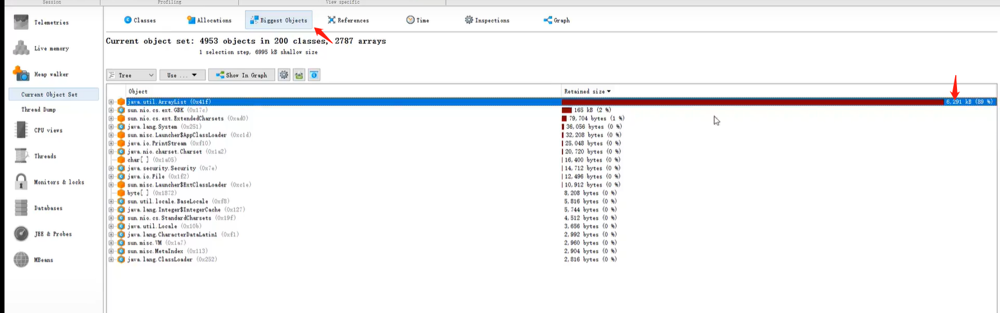
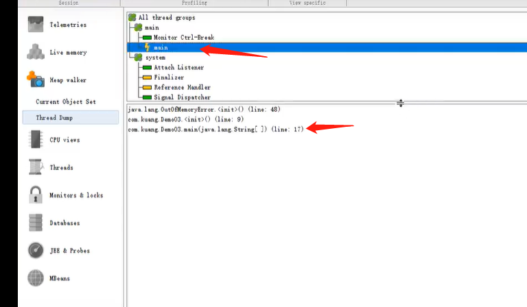
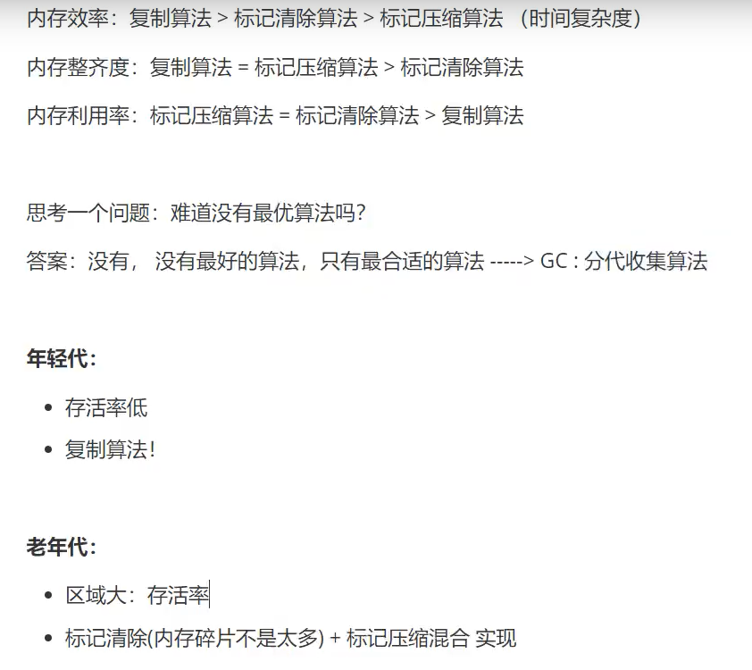
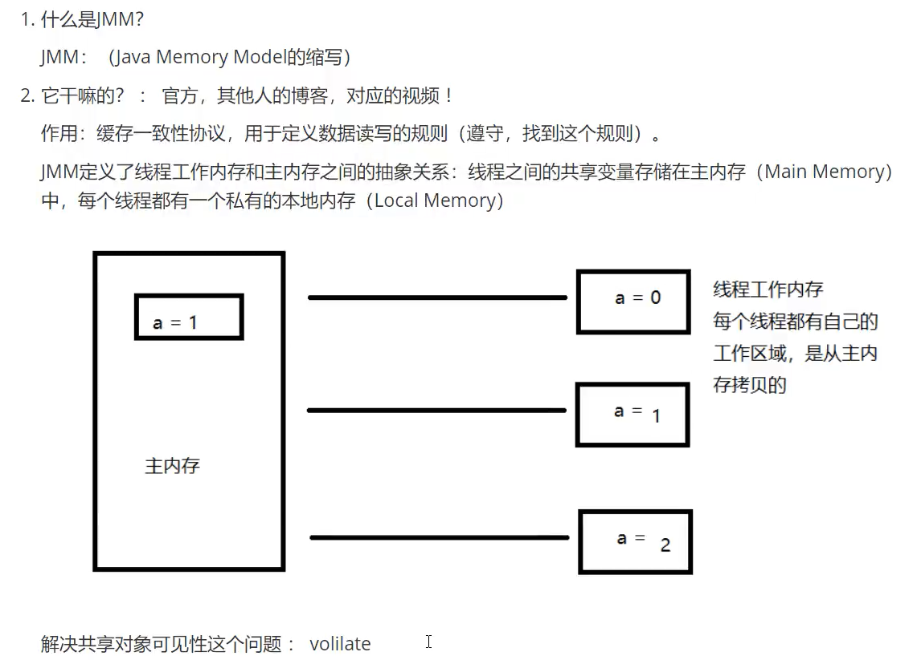
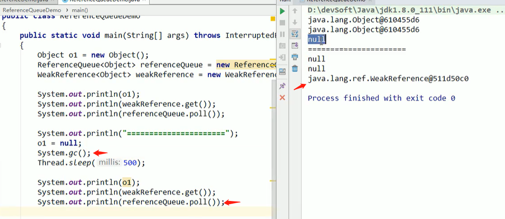

#### （一）JVM体系结构

> JVM的位置

jvm在jre中已经带有了，直接把jre（java运行环境）拷贝到另一台电脑就可以执行java程序了。

>JVM体系结构

栈不会有垃圾，因为用完就全部弹出去了，新的才能进来。

所以99%的垃圾回收都在方法区和堆。堆存放的是new的对象和数组，方法区存放所有的class和static变量。而栈只存放基本变量类型和引用对象的变量。

完整版图：

#### （二）类加载器  

类加载器作用：加载Class文件~

1.虚拟机自带的加载器

2.启动类（根）加载器 //Bootstrap;   rt.jar(底层是c++/c写的所以java程序找不到)

3.扩展类加载器  //  EXtension;    jre/lib/ext

4.应用程序加载器 //Application;

#### （三）双亲委派机制

双亲委派机制为了保证核心类的安全不被篡改，若类加载自定义加载器，则有植入危险代码的风险。

1.类加载器收到类加载的请求

2.将这个请求向上委托给父类加载器去完成，一直向上委托，直到启动类加载器

3.启动加载器检查能否加载当前这个类，能加载就结束，使用当前的加载器；否则抛出异常，通知子类加载器加载

4.重复3，直到扩展类加载器和应用程序加载器都没有的话就会使用当前自定义类加载器。

类的方法有些是native方法，这种java处理不了，所以调用了c++写的底层的代码。

> 双亲委派机制源码

#### （四）沙箱安全机制

java安全模型的核心就是java沙箱。沙箱就是一个限制程序运行的环境，将JVM代码限定在虚拟机特定的运行范围中。主要限制系统资源的访问。

>沙箱的基本组件

* 字节码校验器：确保java代码遵循java语言规范。但核心类不经过字节码校验。
* 类装载器：
  * 防止恶意代码干涉善意代码 //双亲委派机制
  * 守护了被信任的类库边界 //双亲委派机制
  * 将代码归入保护欲，确定代码可以执行哪些操作 //沙箱安全机制

#### （五）native

* Thread的底层源码有一个start0方法，带了native关键字。说明java的作用范围达不到了，会去调用底层C++语言的库。

* 带native的方法会进入本地方法栈，调用本地方法接口(JNI)。

本地方法接口(JNI)调用本地方法库就可以扩展java的使用，融合不同的编程语言，实现操作硬件。

> Native Method Stack（本地方法栈）

JVM在内存区域中专门开辟了一块标记区域（Native Method Stack），登记native方法，在最终执行的时候通过JNI加载本地方法库中的方法。

> PC寄存器（程序计数器）

每个线程都有一个程序计数器，是线程私有的，就是一个指针，指向方法区中的方法字节码（用来存储指向一条指令的地址，也就是将要执行的指令代码），比如执行引擎每一次要读取下一条指令的时候+1 。它占用的内存非常小。

> 方法区

方法区是被所有线程共享的，所有字段和方法字节码，以及特殊方法（构造函数，接口代码）也在此定义。

方法区存放static，final，Class，常量池。（1.8以后加载到堆中）

> 对象创建的过程

new对象的过程就是在栈丢入一个引用，在堆中生成这个实例，然后把引用指向实例。实例可能需要一些常量，方法会从常量池中获取。

#### （六）深入理解栈

> 栈

栈内存，主管程序的运行，生命周期和线程同步；线程结束，栈内存也就释放。==不存在垃圾回收问题==。一旦线程结束，栈也就Over！

> 栈存放

8大基本类型+对象引用+实例方法

> 栈运行原理

程序正在执行的方法一定在栈的顶部，执行完就弹出去。栈的原理就是栈帧，就是先进后出。

>  栈溢出错误

main方法首先压入栈，然后test方法压入栈，他又调用a，a又调用test...栈就溢出了。

#### （七）堆

堆存放new的对象和数组，所以JVM的垃圾回收也在这个地方。

三种JVM：

* Sun公司的HotPot，就是我们现在学习的。
* BEA的JRockit
* IBMJ9VM

>  堆

Heap，一个JVM只有一个堆内存，所以垃圾特别多，堆内存的大小是可以调节的。

jdk1.8后，方法区中的类，方法，常量，变量加载到了堆中。

堆内存中还要细分为3个区域:

* 新生区
* 养老区
* 永久区

GC垃圾回收，主要是在伊甸园区和养老区。

假设堆内存满了，OOM，堆内存不够了！

在JDK1.8以后，永久存储区改名叫元空间。

#### （八）新生区 永久区 堆内存调优

==以下三个区都在堆中：==

**新生区**

* 类：诞生和成长的地方，甚至死亡
* 伊甸园：所有对象都是在伊甸园区new出来的
* 幸存者区（0,1）from和to：谁空谁是to（不停的交换）

**老年区**

* 新生区活下来的对象都进了老年区

经过研究，99%的对象都是临时对象！

**永久区**

这个区域常驻内存。用来存放jdk自身携带的Class对象。Interface元数据，存储的是Java运行时的一些环境或类信息，这个区域不存在垃圾回收！关闭VM虚拟机就会释放这个区域的内存！

一个启动类，加载看大量的第三方jar包。tomcat部署了太多应用，大量动态生成的反射类，不断加载直到内存满就会出现OOM。

堆内存调优：可以调整分配的内存和初始化的内存。

当新生区和老年区不断GC还有新进程进来就会堆内存溢出（OOM).

#### (九)分析OOM原因

一个项目出现了OOM故障就要研究为什么出错，能看到第几行出错。使用JPofiler工具分析OOM原因。

JProfiler的作用：

* 分析Dump内存文件，快速定位内存泄露
* 获得堆中的数据
* 获得大的对象
* ...

==使用==

1.在ide中调参，让程序出现OOM异常时dump文件出来。

2.在该类的class文件找到dump出的hprof文件，双击打开该文件通过JProfiler找哪里出现错误。

3.找到是arraylist出了问题

4.找到main线程的第几行出现了错误

> 调优参数
>

* -Xms ：设置初始化内存分配大小  默认1/64

* -Xmx：设置最大分配内存 默认1/4

* -XX：+PrintGCDetaile  打印GC垃圾回收

* -XX：+HeapDumpOnOutOfMemoryError   出现OOM异常时触发上述操作

> OOM种类

1.java.lang.StackOverflowError:栈内存溢出，相互调用造成

2.java.lang.OutOfMemoryError:Java heap space：堆内存溢出，new的对象太多或太大导致

3.java.lang.OutOfMemoryError:GC overhead limit exceede：GC回收时间过长

4.java.lang.OutOfMemoryError:Direct buffer memory：本地内存满了

5.java.lang.OutOfMemoryError:unable to create new native thread：线程创太多了，超过系统承载极限

6.java.lang.OutOfMemoryError:Metaspace：类占据太多占满了元空间

#### （十）GC垃圾回收算法

GC主要在堆中进行（1.8后方法区在堆里面）。JVM在进行GC回收时大部分都是回收新生代。轻GC主要针对新生代和幸存区，重GC主要针对全局。

> 引用计数法

谁空谁出去，PCB为0时这个对象就被抛弃了。

> 复制算法

from和to是交替变化的，不断的轻GC用复制算法将对象全部都放到from区中。

* 每一次GC先把伊甸园区清空到TO区，然后再把FROM区的也清空到TO区。每一次伊甸园清空完之后是空的，TO区也是空的。（from和to区由复制算法交替互换）

* 若幸存区活过15次的就进入老年区，没有活过的就死了。

* 复制算法的优点：没有内存碎片；缺点：浪费内存空间，多了一半空间永远是空to。

复制算法最佳使用场景：对象存活度较低的时候。（新生区中使用）

> 标记压缩清除算法

* 优点：不需要额外空间！
* 缺点：两次扫描严重浪费时间，会产生内存碎片。

优化：

**总结**

#### （十一）JMM

#### （十二）垃圾回收器

查看默认垃圾回收器：-XX:+PrintCommandLineFlags  -version

GC算法是内存回收的方法论，垃圾收集器是算法的落地实现。

> SerialGC(串行)

> ParallelGC(并行)  (ParNewGC,ParalleGC,ParalleOldGC)

==ParNew：==

==Parallel Scavenge（系统默认）：==

==Parallel Old:==

> CMSGC(并发)

用户线程和垃圾收集线程同时执行（不一定是并行，可能是交替执行），不需要停顿用户线程。互联网公司多用它，适用于对响应时间有要求的场景。有内存碎片，所以又出现了G1.

==四步过程：==

1.初始标记（CMS initial mark）：标记GC Roots能直接关联的对象，速度很快，仍需暂停所有工作线程

2.并发标记（CMS concurrent mark）和用户线程一起：进行GC Roots跟踪的过程，和用户线程一起工作，不需要暂停工作线程。主要标记过程，标记全部对象

3.重新标记（CMS remark）：修正并发标记期间，因用户程序继续运行而导致标记产生变动的那一部分对象的标记记录，仍需要暂停所有工作线程。由于并发标记时，用户线程仍然运行，因此在正式清理前，再做修正。

4.并发清除（CMS concurrent sweep）和用户线程一起：消除GC Roots不可达对象，和用户线程一起工作，不需要暂停工作线程。基于标记结果，直接清理对象。

==优点：==并发收集低停顿

==缺点：==并发执行，对cpu资源压力大；采用标记清除算法会导致大量碎片

> G1GC

==G1底层原理：==

1.Region区域化垃圾收集器：最大好处是化整为零，避免全内存扫描，只需按照区域来进行扫描即可。启动时可通过参数：-XX:G1HeapRegionSize=n可指定分区大小（1MB~32MB，2的幂），默认将整堆化为2048个分区。

2.回收步骤

3.4步过程

==常用配置参数：==

==与CMS比较：==

> 七大垃圾回收器使用区域

> 如何选择垃圾回收器

#### （十三）四大引用

引用组织架构图：

> 强引用（默认机制）

把一个对象复制给一个引用变量，这个引用变量就是一个强引用。JVM垃圾回收就算OOM了也不会对强引用对象进行回收。obj1和obj2都是强引用，new的对象就是典型的强引用。

> 软引用

内存足够就不会被回收，内存不足就被回收。故意产生大对象，造成OOM，内存不够用了，软引用就被回收。

使用场景：

> 弱引用

只要GC了就回收。适用场景与软引用一样适合有大量图片加载的地方。

WeakHashMap：只要GC后，WeakHashMap里面的K-V就会被回收。

> 虚引用

在任何时候都能被GC，不能单独使用，虚引用必须和引用队列（ReferenceQueue）联合使用。

虚引用的主要作用是跟踪对象被垃圾回收的状态。虚引用get方法总是返回null，形同虚设。

即使用finalize()方法在垃圾收集器将对象从内存中清除出去之前做必要的清理工作。类似于AOP的后置通知，是一种通知机制。

> 引用队列

就是引用被GC回收前需要放到引用队列保存一下。

#### （十三）GCRoot 可达性分析

 GC垃圾回收通过GCRoot判断一个对象是不是可回收的垃圾。就是一系列对象，相互之间虽然有引用，但是如果不是从GC Roots的对象作为起点的话，那这些就是要被垃圾回收的对象。

那么哪些对象可以当做GC Roots呢？

