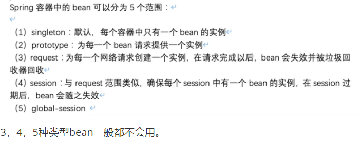
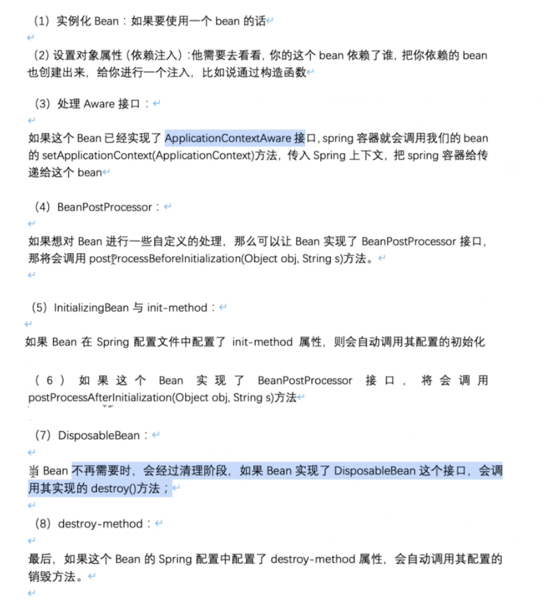
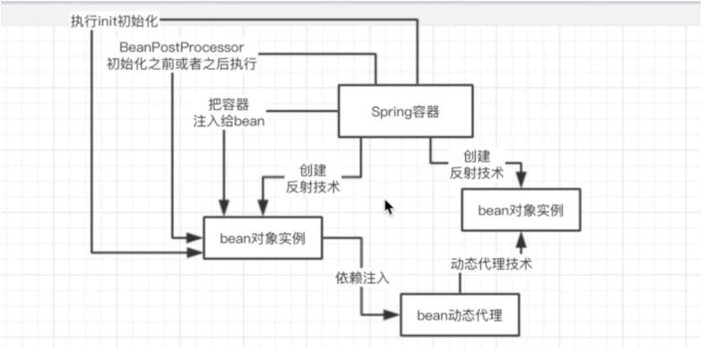

#### （一）bean

spring的bean默认情况下是单例的，如果多线程情况下，是线程不安全的。 

#### （二）spring的核心框架

> spring bean的生命周期

你在系统里使用xml或注解，定义一大堆的bean。

==bean的生命周期：==

==bean生命周期流程图：==

#### （三）IOC

IOC（Inverse Of Control），反转控制。通过spring提供的IOC容器，可以将对象间的依赖关系交由 Spring 进行控制，避免硬编码所造成的过度程序耦合。用户也不必再为单例模式类、属性文件解析等这些很底层的需求编写代码，可以更专注于上层的应用。

#### （四）AOP

AOP（Aspect Oriented Programming），面向切面编程。通过 Spring 的 AOP 功能，方便进行面向切面的编程，许多不容易用传统 OOP 实现的功能可以通过 AOP 轻松应付。

